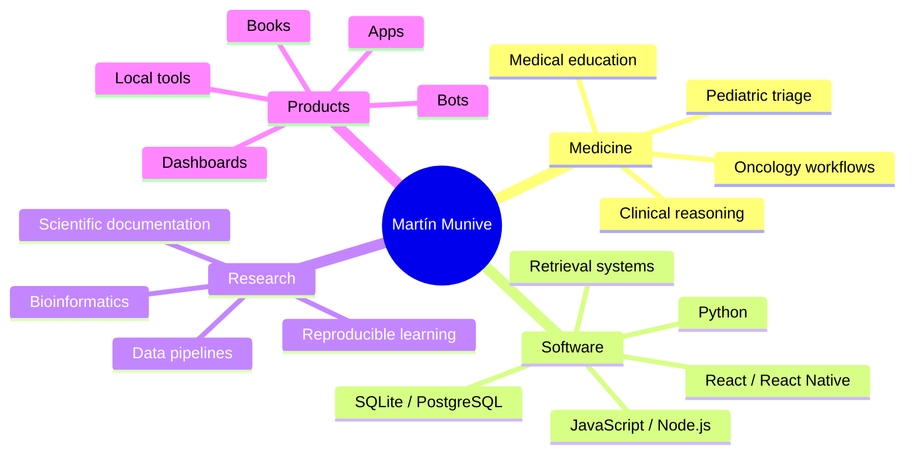
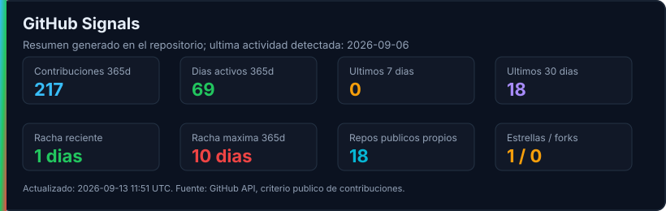
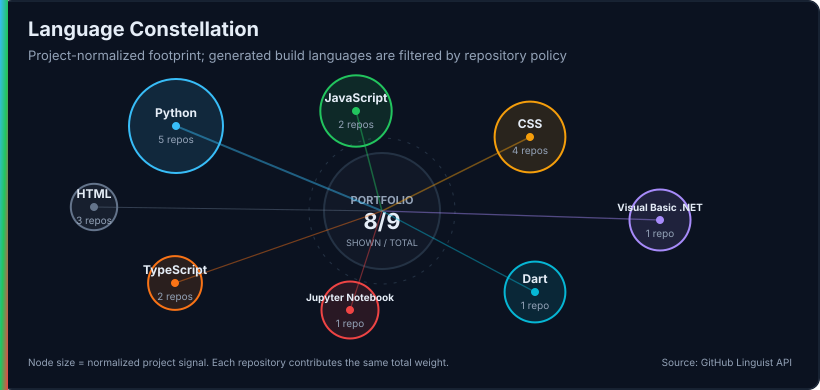
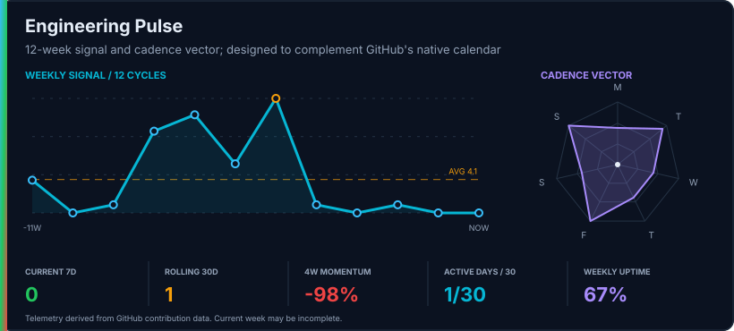

<div align="center">


**Clinical software · Biomedical data · Medical education · Research tools**

[Featured systems](#featured-systems) · [Engineering map](#engineering-map) · [GitHub signals](#github-signals) · [Scientific contributions](#scientific-contributions)

</div>

---

## Clinical + Scientific Software

I build software at the intersection of medicine, data, automation and education systems.

My work focuses on tools that make complex information easier to retrieve, structure and use: clinical decision support prototypes, oncology regulatory data, biomedical retrieval systems, medical education platforms, bioinformatics utilities and technical books for learning programming through biomedical problems.



## Featured Systems

<table>
  <tr>
    <td width="50%">
      <h3><a href="https://github.com/Martin-Munive/INVIMA-HematoOncologia">INVIMA Hemato-Oncologia</a></h3>
      <p>Local Python system for consolidating oncology drug information in Colombia from INVIMA, UNIRS, POS Populi and curated manual profiles.</p>
      <p>
        
        
        
      </p>
    </td>
    <td width="50%">
      <h3><a href="https://github.com/Martin-Munive/RAG_Medicina-Oncologica">RAG Medicina Oncologica</a></h3>
      <p>Experimental Retrieval-Augmented Generation prototype for exploring clinical documents and oncology guidelines with traceable retrieved context.</p>
      <p>
        
        
        
      </p>
    </td>
  </tr>
  <tr>
    <td width="50%">
      <h3><a href="https://github.com/Martin-Munive/NCBI-Web-Crawler-Proteios">NCBI Web Crawler - PROTEIOS</a></h3>
      <p>Bioinformatics utility for NCBI protein sequence retrieval and motif filtering. Proteios v1.0 was used in published neuropeptide evolution research.</p>
      <p>
        
        
        <a href="https://doi.org/10.1007/s00239-023-10146-9"></a>
      </p>
    </td>
    <td width="50%">
      <h3><a href="https://github.com/Martin-Munive/Materia_Medica_Digitalis">Materia Medica Digitalis</a></h3>
      <p>Web book about Python algorithms, data structures and computational thinking through biomedical and life-science problems.</p>
      <p>
        
        
        
      </p>
    </td>
  </tr>
  <tr>
    <td width="50%">
      <h3><a href="https://github.com/Martin-Munive/AIEPI">AIEPI-Mobile</a></h3>
      <p>Clinical software concept for pediatric triage and management based on AIEPI workflows, semaphorized risk classification and structured clinical logic.</p>
      <p>
        
        
        
      </p>
    </td>
    <td width="50%">
      <h3><a href="https://github.com/Martin-Munive/CEM_QA">CEM Q&A / SIFCEM</a></h3>
      <p>Question-and-answer platform for health professionals, designed around clinical reasoning, specialty classification, distractor logic, structured feedback and progress tracking.</p>
      <p>
        
        
        
      </p>
    </td>
  </tr>
</table>

## Engineering Map

<div align="center">

<strong>Python</strong> · <strong>JavaScript / Node.js</strong> · <strong>React / React Native</strong> · <strong>SQLite / PostgreSQL</strong> · <strong>GitHub Actions</strong> · <strong>Markdown / Jupyter Book</strong>

</div>

| Area | What I build | Representative repositories |
|---|---|---|
| Clinical systems | Local tools, oncology data, pediatric triage, medical education | [INVIMA](https://github.com/Martin-Munive/INVIMA-HematoOncologia), [AIEPI](https://github.com/Martin-Munive/AIEPI), [CEM Q&A / SIFCEM](https://github.com/Martin-Munive/CEM_QA) |
| Retrieval systems | Document exploration and traceable biomedical retrieval workflows | [RAG Medicina Oncologica](https://github.com/Martin-Munive/RAG_Medicina-Oncologica) |
| Bioinformatics | Protein sequence retrieval, motif filtering and scientific software documentation | [Proteios](https://github.com/Martin-Munive/NCBI-Web-Crawler-Proteios), [NCBI-Proteios legacy](https://github.com/Martin-Munive/NCBI-Proteios) |
| Books and education | Technical books with biomedical examples and progressive computational thinking | [Materia Medica Digitalis](https://github.com/Martin-Munive/Materia_Medica_Digitalis), [Python por Fragmentos](https://github.com/Martin-Munive/Python-por-fragmentos-Libro-de-estudio) |
| Automation and bots | Community automation, message routing and operational utilities | [DISCORD Channels Bot](https://github.com/Martin-Munive/DISCORD_Channels-Bot) |
| Data analysis | Forecasting, reproducible pipelines and exploratory dashboards | [MATER LOTTO](https://github.com/Martin-Munive/MATER_LOTTO), [Gastos Diarios](https://github.com/Martin-Munive/GASTOS_DIARIOS) |

## Current Focus

```text
medicine       -> clinical reasoning, oncology, pediatric triage, medical education
software       -> Python, JavaScript, local-first tools, data systems, automation
retrieval      -> document workflows, traceable search, evaluation-aware prototypes
publishing     -> web books, scientific documentation, technical learning paths
research tools -> bioinformatics utilities and reproducible computational workflows
```

## GitHub Signals

<div align="center">



<br>



<br>



<sub>These components are generated locally by this repository. See <a href="docs/profile-components.md">profile component architecture</a>.</sub>

</div>

## Scientific Contributions

### Published Research Software

Proteios v1.0 was used in published neuropeptide evolution research:

> Cadena-Caballero, C. E., Munive-Arguelles, N., Vera-Cala, L. M., et al. APGW/AKH Precursor from Rotifer Brachionus plicatilis and the DNA Loss Model Explain Evolutionary Trends of the Neuropeptide LWamide, APGWamide, RPCH, AKH, ACP, CRZ, and GnRH Families. Journal of Molecular Evolution 91, 882-896 (2023).

- DOI: <https://doi.org/10.1007/s00239-023-10146-9>
- PubMed: <https://pubmed.ncbi.nlm.nih.gov/38102415/>
- Repository: <https://github.com/Martin-Munive/NCBI-Web-Crawler-Proteios>

### Patent Documentation

Listed coinventor in patent family **CO2017004500A1 / WO2018203280A1**, related to nucleotide mixtures for nucleic acid amplification and sequencing. The patent records list Martin Munive as **Nestor Martin Munive Arguelles**.

- Documentation repository: <https://github.com/Martin-Munive/PATENT_Nucleotide-Mixtures-DNA-RNA-Amplification>
- Google Patents: <https://patents.google.com/patent/CO2017004500A1/en>
- PCT publication: <https://patents.google.com/patent/WO2018203280A1/en>

## Design Philosophy

I like building systems that are:

- clinically meaningful;
- technically inspectable;
- local-first when privacy or reproducibility matters;
- honest about their current stage;
- useful for learning, research or decision support without replacing expert judgment.
